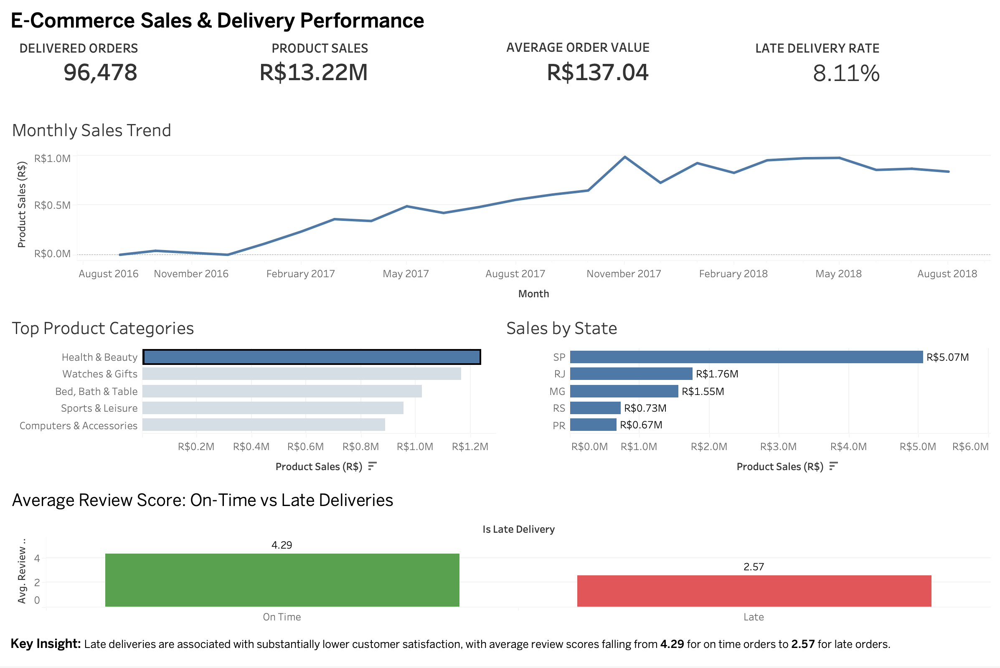

# E-Commerce Sales Analysis

I built this project to practise working with a real e-commerce dataset from the raw data stage through to SQL analysis and dashboard creation.

The project uses the Olist Brazilian e-commerce dataset, which contains information about orders, customers, products, sellers, payments, reviews and deliveries.

I used Python for cleaning and preparing the data, SQLite and SQL for the analysis, and Tableau for the final dashboard.

## Dashboard



The dashboard gives an overview of sales and delivery performance.

The main KPIs are:

- 96,478 delivered orders
- R$13.22M in product sales
- R$137.04 average order value
- 8.11% late delivery rate

I also included monthly sales performance, the top product categories, sales by state and a comparison of customer review scores for on-time and late deliveries.

## Questions I looked at

I wanted the analysis to answer practical business questions rather than just run SQL queries on the dataset.

Some of the main questions were:

- How have sales changed over time?
- Which product categories generate the most sales?
- Which states generate the most sales?
- What percentage of delivered orders arrive late?
- Are late deliveries associated with lower customer review scores?
- How much repeat customer activity is there?

## Data cleaning and preparation

The original dataset is split across several CSV files, so I first explored each table and checked the data quality before doing any analysis.

I found a few issues that needed to be handled. For example, the geolocation data contained many duplicate records, some products did not have category names, and some delivery dates were missing.

I used Python and pandas to clean and prepare the data. This included:

- converting date columns to the correct format
- creating delivery time and delivery delay fields
- creating a flag for late deliveries
- removing duplicate geolocation records and creating one location per ZIP prefix
- translating product category names into English
- assigning `unknown` where the product category was genuinely missing
- checking relationships between orders, products, sellers, payments and reviews

I kept the data quality checks, preparation and validation as separate scripts so that each stage of the process can be checked independently.

After cleaning the data, I ran a validation script to make sure there were no unexpected duplicate ZIP prefixes, broken relationships between the main tables or invalid delivery calculations.

## SQL analysis

After preparing the data, I loaded the processed CSV files into a SQLite database.

I then used SQL to analyse:

- overall order and sales performance
- average order value
- monthly sales trends
- product category performance
- sales by customer state
- repeat customers
- delivery performance
- the relationship between delivery delays and customer reviews

The main SQL queries can be found in:

`sql/business_queries.sql`

I also kept separate SQL data quality checks in:

`sql/data_quality_checks.sql`

## Key findings

The dataset contains 96,478 successfully delivered orders, generating around R$13.22M in product sales.

Health & Beauty was the highest-selling product category, followed by Watches & Gifts and Bed, Bath & Table.

São Paulo (SP) was the largest market in the dataset by a considerable margin, generating around R$5.07M in product sales.

Another result I found interesting was the difference in customer reviews between on-time and late deliveries.

On-time orders had an average review score of 4.29 out of 5, while late orders averaged only 2.57.

This is a difference of 1.72 points. This does not prove that late delivery caused the lower review score, but it shows a strong association between delivery performance and customer satisfaction in this dataset.

## Tools used

- Python
- pandas
- SQL
- SQLite
- Tableau
- Git
- GitHub

## Project structure

```text
ecommerce-sales-analysis/
├── data/
│   ├── raw/
│   └── processed/
├── docs/
├── images/
│   └── ecommerce_dashboard.png
├── scripts/
│   ├── data_quality_audit.py
│   ├── prepare_data.py
│   ├── validate_processed_data.py
│   └── create_database.py
├── sql/
│   ├── data_quality_checks.sql
│   └── business_queries.sql
├── Tableau/
│   └── ecommerce_sales_dashboard.twbx
├── .gitignore
└── README.md
```

The raw and processed datasets are not stored in the repository. They are generated or stored locally and excluded through `.gitignore`.

## How to run the project

Download the Olist dataset and place the original CSV files inside:

```text
data/raw/
```

From the project directory, run:

```bash
python scripts/data_quality_audit.py
python scripts/prepare_data.py
python scripts/validate_processed_data.py
python scripts/create_database.py
```

The preparation script creates the cleaned datasets in `data/processed/`.

The database script then creates:

```text
data/ecommerce.db
```

The database is also excluded from Git because it can be recreated from the processed data.

The Tableau workbook is available in the `Tableau/` folder.

## Dataset

This project uses the Brazilian E-Commerce Public Dataset by Olist.

The dataset contains approximately 100,000 orders and includes information about customers, products, sellers, payments, reviews and delivery performance.

The original dataset is not included in this repository.
